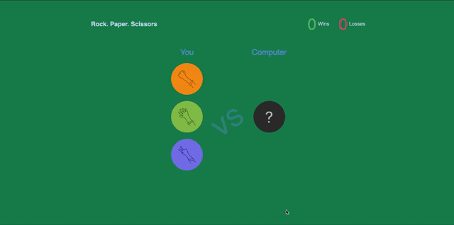

- Stone-Paper-Scissor game built in React using React states.
- To run the project:
    - Clone or Download the repo.
    - Go to the folder directory.
    - Run `npm install`
    - Used React svg component for images used.
    - Run react server `npm start`

- `useEffect` - React hook used for side effects for function component. Data fetching, setting up a subscription, and manually changing the DOM in React components are all examples of side effects. The basic use of `useEffect` is to tell React that your component needs to do something after the render.
